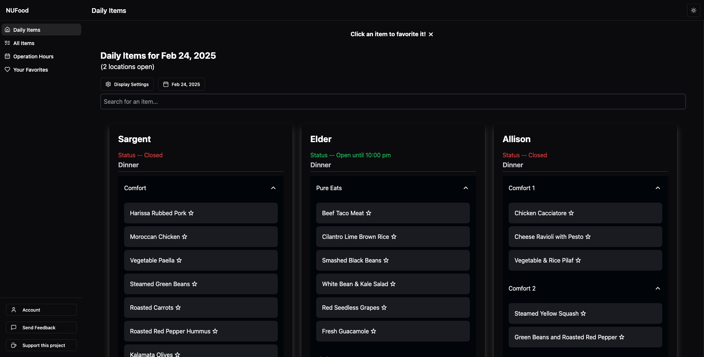
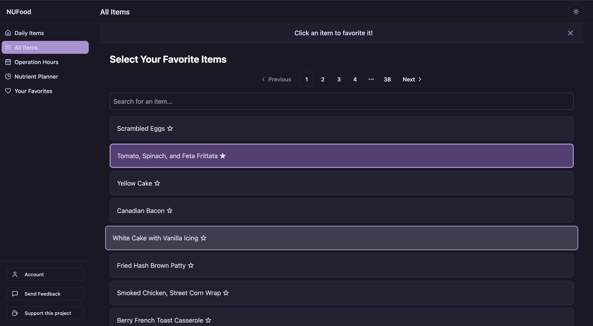
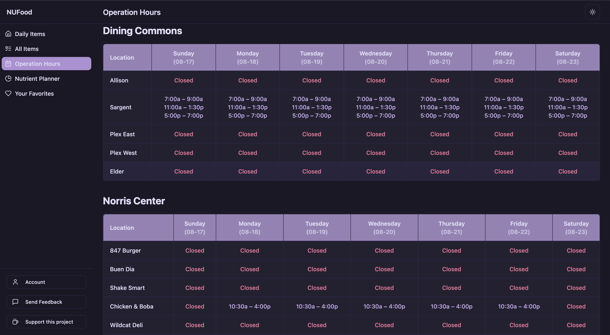
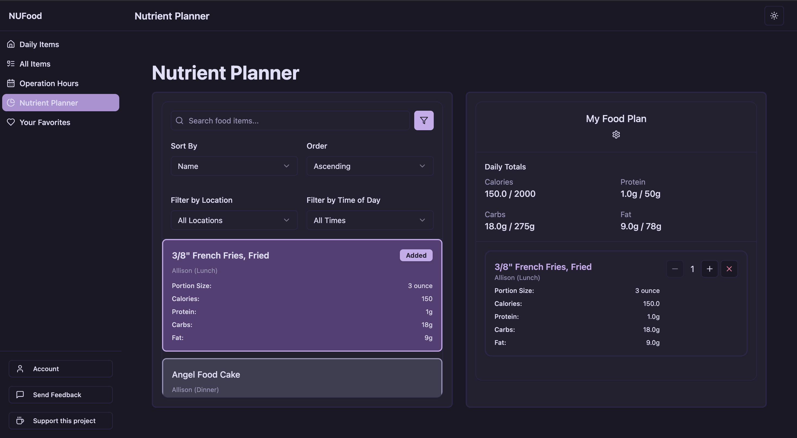
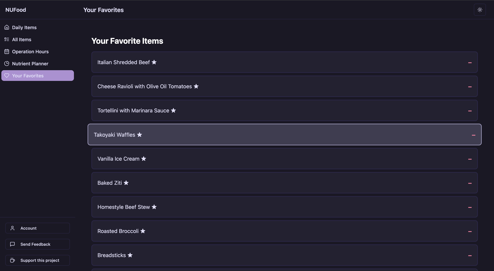

# NUFood

A modern, fast alternative to Northwestern University's Dine on Campus app. View dining hall menus, operating hours, track your nutrition, and save your favorite foods to get personalized recommendations on where to dine.

Live at: [nufood.me](https://nufood.me)

## Features

-  Fast, responsive interface
-  Real-time dining hall items and operating hours
-  View future and past daily menus within the week
-  Search through all available menu items
-  Save favorite foods and get personalized recommendations
-  Mobile-friendly design
-  Email notifications of where favorite foods are
-  Nutrition tracking to hit your goals
-  Retain the last 30 days of successfully scraped menus

## Screenshots

### Weekly Items View

### All Items View

### Operation Hours

### Nutrition Tracker

### Favorite Items Selection

## Contributing

This is primarily a personal project for Northwestern University students, but feel free to open issues if you encounter any bugs or have suggestions for improvements.
