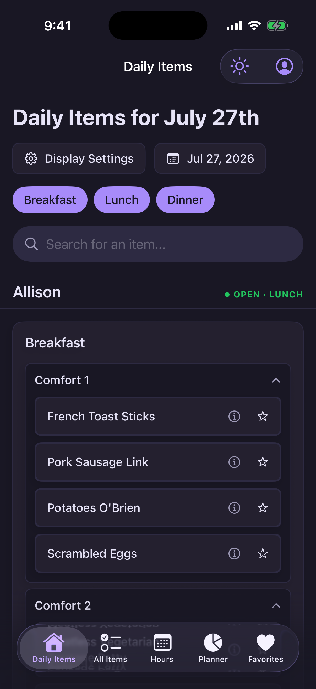
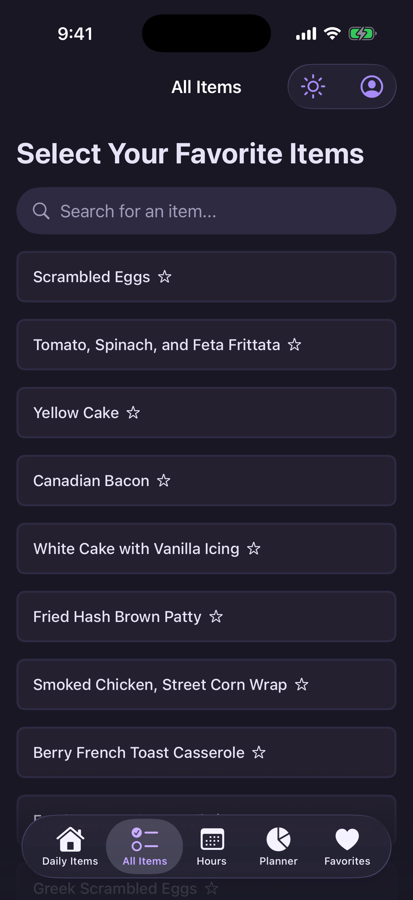
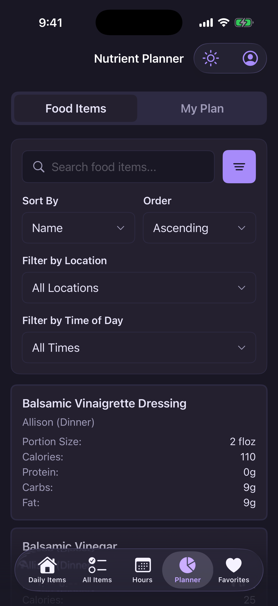

# NUFood

### Know what's worth the walk.

Every Northwestern dining menu in one place. See what's being served, search it,
save your favorites, hit your macros.

&nbsp;&nbsp;
**[nufood.me](https://nufood.me)**

 

&nbsp;
&nbsp;

 

Built by a student who got tired of Dine on Campus. Menus refresh through the day,
favorites tell you where your food is, and the planner adds up calories and macros as you build your plate.

Bugs or ideas → [open an issue](../../issues).
