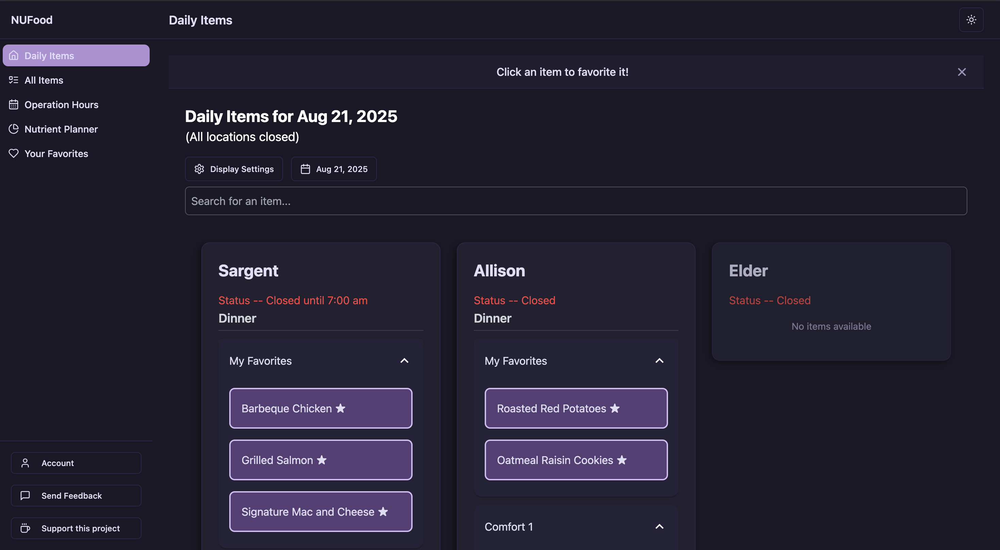

# NUFood

A modern, fast alternative to Northwestern University's Dine on Campus app. View dining hall menus, operating hours, track your nutrition, and save your favorite foods to get personalized recommendations on where to dine.

Live at: [nufood.me](https://nufood.me)

## Features

-  Fast, responsive interface
-  Real-time dining hall items and operating hours
-  View future and past daily menus within the week
-  Search through all available menu items
-  Save favorite foods and get personalized recommendations
-  Mobile-friendly design
-  Email notifications of where favorite foods are
-  Nutrition tracking to hit your goals

## Tech Stack

### Frontend
- React with TypeScript
- Vite for build tooling
- Tailwind CSS for styling
- Firebase Authentication
- Google Analytics for usage tracking

### Backend
- Go (Golang) for API and scraping
- PostgreSQL database 
- Firebase Admin SDK for auth verification

## Deployment

The application is deployed using:
- Frontend: Vercel
- Backend: Railway
- Database: Railway PostgreSQL

## Screenshots

### Weekly Items View

### Operation Hours

### All Items View

### Nutrition Tracker

### Favorite Items Selection

## Contributing

This is primarily a personal project for Northwestern University students, but feel free to open issues if you encounter any bugs or have suggestions for improvements.
